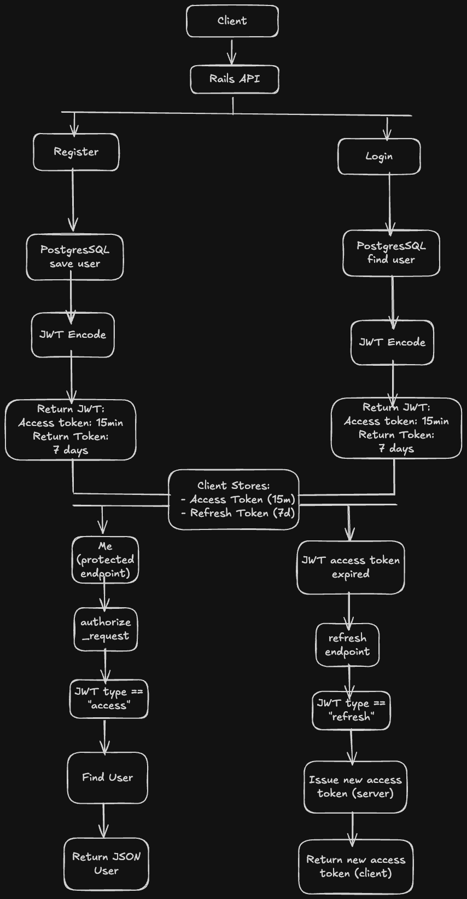

# AUTHENTICATION API


## Overview

This API provides:
	•	User registration
	•	User login
	•	Token refresh
	•	Authenticated user retrieval

JSON requests are received to sign up, log in, and retrieve authenticated user information.

Users are persisted in a PostgreSQL database using Rails’ ActiveRecord ORM. Passwords are securely hashed using bcrypt.

Authentication is handled using stateless JSON Web Tokens (JWT). Upon successful login, the API issues:
	•	A short-lived access token
	•	A long-lived refresh token

Each request is authenticated by validating and decoding the JWT, allowing the API to identify the current user without storing session data on the server. The access token must be included in the Authorization header for protected endpoints.

---

### How Authentication Works
Authentication is handled using stateless JSON Web Tokens (JWT). When a user successfully logs in, the server issues a signed JWT containing the user’s ID and an expiration claim. The token is signed using a secret key, which allows the server to verify the token’s authenticity and detect any tampering.

Successful login, the server issues:
	•	Access Token
	•	Used for accessing protected endpoints
	•	Expires in 15 minutes
	•	Contains: user_id, exp, type: "access"
	•	Refresh Token
	•	Used only to obtain new access tokens
	•	Expires in 7 days
	•	Contains: user_id, exp, type: "refresh"

The server does not store session data.
Each request is authenticated solely by verifying the JWT signature and claims.

On each request, the server extracts and decodes the JWT using a dedicated decoder service. If the token is valid and unexpired, the associated user is identified and the request is authorized. If the token is missing, invalid, or expired, the server responds with a 401 Unauthorized error.

---

### Why Access and Refresh Tokens?
Using only long-lived tokens increases the impact of tokens being compromised.

This architecture provides:
	•	Reduced exposure window (15-minute access tokens)
	•	Controlled session renewal
	•	Stateless scalability
	•	Clear separation of token responsibilities

---

### Why JWTs vs Sessions?
JWTs are used instead of sessions to enable stateless authentication. With sessions, the server must store and manage session data for each authenticated user, whereas JWTs allow the client to prove its identity on each request by presenting a signed token.

This approach reduces server-side state, simplifies horizontal scaling, and is well-suited for JSON-based APIs consumed by multiple types of clients such as SPAs, mobile apps, and third-party services.

JWTs are better suited for scalability and flexibility, which makes them a good fit for APIs.

---

## Architecture & Request Flow



## Tech Stack
- Ruby on Rails
- PostgreSQL
- JWT Authentication

## Setup

### Requirements
- Ruby 3.2.x
- Rails 7.1.x
- PostgreSQL

### Installation
```bash
bundle install
rails db:setup
Create a `.env` file based on `.env.example` before running the server.
rails s
