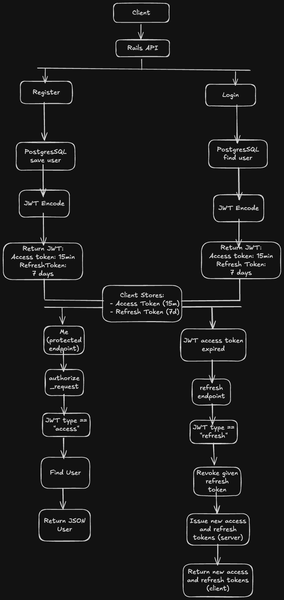

# AUTHENTICATION API

## Overview

This API provides:
	•	User registration
	•	User login
	•	Token refresh
	•	Authenticated user retrieval

JSON requests are received to sign up, log in, and retrieve authenticated user information.

Users are persisted in a PostgreSQL database using Rails’ ActiveRecord ORM. Passwords are securely hashed using bcrypt.

Authentication is handled using stateless JSON Web Tokens (JWT). Upon successful login, the API issues:
	•	A short-lived access token
	•	A long-lived refresh token

Each request is authenticated by validating and decoding the JWT, allowing the API to identify the current user without storing session data on the server. The access token must be included in the Authorization header for protected endpoints.

---

### How Authentication Works
Authentication is handled using stateless JSON Web Tokens (JWT). When a user successfully logs in, the server issues a signed JWT containing the user’s ID and an expiration claim. The token is signed using a secret key, which allows the server to verify the token’s authenticity and detect any tampering.

Successful login, the server issues:
	•	Access Token
	•	Used for accessing protected endpoints
	•	Expires in 15 minutes
	•	Contains: user_id, exp, type: "access"
	•	Refresh Token
	•	Used only to obtain new access tokens
	•	Expires in 7 days
	•	Contains: user_id, exp, type: "refresh"

Refresh tokens are securely stored in the database as hashed digests.

When a refresh token is used:
	1.	The server verifies the token
	2.	The corresponding token record is retrieved
	3.	The token is revoked
	4.	A new refresh token is issued
	5.	A new access token is generated

This process is known as Refresh Token Rotation.

---

### Refresh Token Rotation
This API implements refresh token rotation to improve security.

When a client sends a refresh request:
POST /refresh
Authorization: Bearer <refresh_token>

The server performs the following steps:
	1.	Validate the refresh token
	2.	Find the corresponding token record in the database
	3.	Ensure the tokenmis not revoked or has not expired
	4.	Revoke the used refresh token
	5.	Issue a new refresh token
	6.	Issue a new access token

This prevents a previously used refresh token from being reused if it is compromised.

---

### Token Storage
The server does not store session data.
Each request is authenticated solely by verifying the JWT signature and claims.

On each request, the server extracts and decodes the JWT using a dedicated decoder service. If the token is valid and unexpired, the associated user is identified and the request is authorized. If the token is missing, invalid, or expired, the server responds with a 401 Unauthorized error.

The API returns both tokens as JSON upon login or registration. The client is responsible for storing and managing these tokens. Common storage strategies include in-memory variables, sessionStorage, or localStorage — each with different security tradeoffs. This API does not prescribe a storage mechanism.
The server has no visibility into how or where tokens are stored after they are issued.

---

### Logout & Token Revocation
Logout is handled by revoking the refresh token server-side. The client initiates this by sending the refresh token to the logout endpoint:
DELETE /logout
Authorization: Bearer <refresh_token>

The server will:

- Look up the refresh token record by its digest
- Mark it as revoked in the database
- Return a 200 response

Since access tokens are entirely stateless, the server can't invalidate them directly. A revoked session's access token will remain technically valid until its 15-minute expiry. The client is expected to discard both tokens from storage upon receiving a successful logout response.

This is a tradeoff of stateless JWT authentication.

---

### Why Access and Refresh Tokens?
Using only long-lived tokens increases the impact of tokens being compromised.

This architecture provides:
	•	Reduced exposure window (15-minute access tokens)
	•	Controlled session renewal
	•	Stateless scalability
	•	Clear separation of token responsibilities

---

### Why JWTs vs Sessions?
JWTs are used instead of sessions to enable stateless authentication. With sessions, the server must store and manage session data for each authenticated user, whereas JWTs allow the client to prove its identity on each request by presenting a signed token.

This approach reduces server-side state, simplifies horizontal scaling, and is well-suited for JSON-based APIs consumed by multiple types of clients such as SPAs, mobile apps, and third-party services.

JWTs are better suited for scalability and flexibility, which makes them a good fit for APIs.

---

## Architecture & Request Flow

## Tech Stack
- Ruby on Rails
- PostgreSQL
- JWT Authentication

# Setup

### Requirements
- Ruby 3.2.x (recommend managing with rbenv or asdf)
- Rails 7.1.x
- PostgreSQL (must be running locally)

### Installation

### Clone and install
git clone https://github.com/Aharown/auth_api.git
cd auth_api
bundle install

### Set up the database
rails db:setup

### Start the server
rails s
